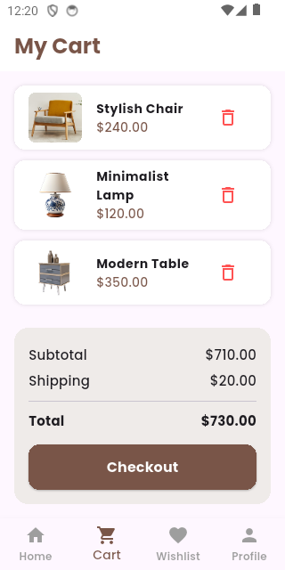

# 🏡 Home Decor App

Aplikasi **Home Decor App** merupakan aplikasi mobile berbasis **Flutter** yang dirancang untuk memberikan pengalaman berbelanja dekorasi rumah secara modern, interaktif, dan estetis.  
Aplikasi ini menampilkan berbagai kategori produk seperti **Best Seller**, **New Collection**, serta fitur tambahan seperti **Cart**, **Wishlist**, dan **Profile Page**.  

Desain aplikasi diadaptasi dari [Figma Home Decor App UI Kit](https://www.figma.com/design/lZMfNa7bt1VyKcLzFpuX0J/Home-Decor-App-Mobile-UI-Kit).

---

## 📱 Fitur Utama

### 🏠 Home Page
Menampilkan banner promosi dan daftar produk unggulan seperti *Best Seller* dan *New Collection*.  
Menggunakan tampilan horizontal scroll untuk mempermudah eksplorasi produk.

### 🌟 Best Seller Page
Menampilkan produk dengan tingkat penjualan tertinggi.  
Setiap produk memiliki gambar, nama, harga, dan deskripsi singkat.

### 🛋️ New Collection Page
Berisi koleksi produk terbaru dengan gaya tampilan *card grid*.  
Produk ditampilkan secara menarik dan informatif.

### 🛒 Cart Page
Berfungsi sebagai keranjang belanja pengguna.  
Menampilkan daftar produk yang telah ditambahkan beserta subtotal, ongkos kirim, dan total harga.

### 💖 Wishlist Page
Menyimpan produk yang disukai pengguna.  
Memiliki tombol **Add to Cart** untuk memindahkan produk ke halaman Cart.

### 👤 Profile Page
Menampilkan informasi akun pengguna dan menu pengaturan.  
Termasuk opsi *My Orders*, *Shipping Address*, dan *Payment Methods*.

---

## 🧩 Struktur Proyek

```

lib/
│
├── main.dart
├── models/
│   └── product.dart
│
├── data/
│   └── dummy_data.dart
│
├── pages/
│   ├── home_page.dart
│   ├── best_seller_page.dart
│   ├── new_collection_page.dart
│   ├── cart_page.dart
│   ├── wishlist_page.dart
│   └── profile_page.dart
│
└── widgets/
	 └── product_card.dart

````

---

## 🧠 Arsitektur Aplikasi

Aplikasi ini menggunakan **arsitektur sederhana berbasis StatefulWidget**,  yaitu **Vanilla Flutter**.  
Seluruh data produk diambil dari file `dummy_data.dart`, kemudian dikonversi ke model `Product` agar mudah digunakan pada setiap halaman.

---

## 🎨 Desain Antarmuka

- Desain diadaptasi dari **[Figma Home Decor App UI Kit](https://www.figma.com/design/lZMfNa7bt1VyKcLzFpuX0J/Home-Decor-App-Mobile-UI-Kit)**.  
- Warna dominan:  
  - 🟤 **Coklat (#6B4E3D)** untuk teks, ikon, dan tombol.  
  - ⚪ **Putih (#FFFFFF)** untuk latar utama.  
- Font utama menggunakan **Poppins** dari pustaka **Google Fonts**.  
- Ikon diambil dari **Material Icons** bawaan Flutter.  

---

## 🧰 Dependensi (pubspec.yaml)

Berikut dependensi utama yang digunakan:

```yaml
dependencies:
  flutter:
    sdk: flutter
  flutter_svg: ^2.2.1
  google_fonts: ^6.3.2
  cached_network_image: ^3.4.1
  animations: ^2.1.0

flutter:
  uses-material-design: true
  assets:
    - assets/images/
````

> Catatan: Aplikasi tidak menggunakan Provider, Firebase, atau package state management lainnya.

---

## 🚀 Cara Menjalankan Aplikasi

1. **Clone repositori ini**

   ```bash
   git clone https://github.com/username/home_decor_app.git
   ```
2. **Masuk ke direktori proyek**

   ```bash
   cd home_decor_app
   ```
3. **Instal dependensi**

   ```bash
   flutter pub get
   ```
4. **Jalankan aplikasi**

   ```bash
   flutter run
   ```

---

## 🧾 Data Dummy

Seluruh data produk disimpan dalam file `dummy_data.dart`, kemudian dikonversi menjadi model `Product`.
Berikut contoh potongan data:

```dart
final List<Map<String, dynamic>> bestSellerData = [
  {
    "title": "Green Bed",
    "image": "assets/bed.jpg",
    "price": 285.00,
    "description": "Comfortable modern green bed made with premium materials.",
  },
  {
    "title": "Kitchen Cart",
    "image": "assets/cart.jpg",
    "price": 40.00,
    "description": "Compact kitchen cart with wooden design and strong wheels.",
  },
];
```

---

## 🧪 Pengujian Aplikasi

* Seluruh halaman telah diuji pada emulator Android.
* Navigasi antarhalaman berjalan dengan baik menggunakan **BottomNavigationBar**.
* Waktu muat halaman cepat dan antarmuka tampil konsisten tanpa error.

---

## 🔮 Rencana Pengembangan Selanjutnya

Aplikasi ini masih memiliki potensi untuk dikembangkan lebih lanjut, antara lain:

* 🔐 Menambahkan **sistem login dan autentikasi pengguna**.
* ☁️ Mengintegrasikan **Firebase** untuk menyimpan data produk, pengguna, dan transaksi secara real-time.
* 💳 Menambahkan fitur **checkout dan pembayaran online**.
* 🖼️ Meningkatkan **UI responsif** agar optimal di berbagai ukuran layar perangkat.

---

## 👨‍💻 Pengembang

* **Nama:** Abdan Nawwaf El Hibban
* **Proyek:** Flutter Home Decor Store
* **Tujuan:** Tugas praktikum/pengembangan aplikasi mobile berbasis Flutter
* **Bahasa:** Dart (Flutter SDK)

---

## 📝 Lisensi

Proyek ini dibuat untuk keperluan pembelajaran dan pengembangan akademik.
Desain UI diadaptasi dari *Figma Community Home Decor App UI Kit*.

---

## 📸 Cuplikan Tampilan

| Halaman        | Preview                                          |
| -------------- | ------------------------------------------------ |
| Home           |                     |
| Best Seller    |        |
| New Collection |  |
| Cart           |                     |
| Wishlist       |             |
| Profile        |               |

---
