# 🏡 Home Decor App

Aplikasi **Home Decor App** merupakan aplikasi mobile berbasis **Flutter** yang dirancang untuk memberikan pengalaman berbelanja dekorasi rumah secara modern, interaktif, dan estetis.  
Aplikasi ini menampilkan berbagai kategori produk seperti **Best Seller**, **New Collection**, serta fitur lengkap seperti **Cart**, **Wishlist**, **Profile**, dan integrasi penuh dengan **Firebase**.

Desain aplikasi diadaptasi dari [Figma Home Decor App UI Kit](https://www.figma.com/design/lZMfNa7bt1VyKcLzFpuX0J/Home-Decor-App-Mobile-UI-Kit).

---

## 📱 Fitur Utama

### 🏠 Home Page
- Menampilkan banner promosi dan daftar produk unggulan
- Kategori **Best Seller** dan **New Collection** dengan horizontal scroll
- Real-time data dari Firebase Firestore

### 🌟 Best Seller Page
- Menampilkan produk dengan tingkat penjualan tertinggi
- Grid view dengan gambar, nama, harga, dan rating
- Data streaming real-time dari Firebase

### 🛋️ New Collection Page
- Koleksi produk terbaru dengan tampilan card grid
- Sinkronisasi otomatis dengan database

### 🛒 Cart Page
- Keranjang belanja dengan sinkronisasi Firebase
- Fitur increment/decrement quantity
- Subtotal, ongkos kirim, dan total harga otomatis
- **Dialog konfirmasi pembayaran** dengan pilihan metode bayar
- Clear all items dengan konfirmasi

### 💖 Wishlist Page
- Menyimpan produk favorit pengguna ke Firebase
- Tombol **Add to Cart** langsung dari wishlist
- Real-time sync antar device

### 👤 Profile Page
- Informasi akun pengguna (nama, email, foto)
- **My Orders** - Riwayat pesanan
- **Shipping Address** - Kelola alamat pengiriman
- **Payment Methods** - Kelola metode pembayaran
- **Settings** - Dark mode & multi-language
- **Firebase Admin** - CRUD produk (admin only)

### 🔐 Authentication
- Login & Register dengan email/password
- Auto-login dengan Firebase Auth state
- Logout dengan konfirmasi

### 🌙 Dark Mode
- Toggle dark/light mode dari Settings
- Semua halaman mendukung dark mode
- Preferensi tersimpan

### 🌐 Multi-Language
- Dukungan Bahasa Indonesia & English
- Mudah menambah bahasa baru

---

## 🏗️ Arsitektur Aplikasi

```
┌─────────────────────────────────────────────────────────┐
│                      UI Layer                           │
│  (Pages & Widgets)                                      │
├─────────────────────────────────────────────────────────┤
│                   State Management                      │
│  (Providers: Auth, Cart, Wishlist, Settings)            │
├─────────────────────────────────────────────────────────┤
│                   Service Layer                         │
│  (FirebaseService - CRUD Operations)                    │
├─────────────────────────────────────────────────────────┤
│                   Data Layer                            │
│  (Firebase: Firestore, Auth)                            │
└─────────────────────────────────────────────────────────┘
```

Aplikasi menggunakan **Provider Pattern** untuk state management dengan **Firebase** sebagai backend.

---

## 🔥 Firebase Integration

### Struktur Database Firestore

```
firestore/
├── products/                    # Koleksi produk
│   └── {productId}/
│       ├── name, price, image
│       ├── description, category
│       └── createdAt
│
├── users/                       # Koleksi user
│   └── {userId}/
│       ├── name, email, phone
│       ├── cart/                # Sub-koleksi keranjang
│       ├── wishlist/            # Sub-koleksi wishlist  
│       ├── orders/              # Sub-koleksi pesanan
│       ├── addresses/           # Sub-koleksi alamat
│       └── paymentMethods/      # Sub-koleksi pembayaran
│
└── orders/                      # Koleksi orders (global)
```

### Firebase Services
| Service | Fungsi |
|---------|--------|
| **Firebase Auth** | Login, Register, Auto-login |
| **Cloud Firestore** | Database real-time |
| **Firebase Storage** | Upload gambar (opsional) |

---

## 🧩 Struktur Proyek

```
lib/
├── main.dart                    # Entry point & providers setup
│
├── models/
│   └── product.dart             # Model Product
│
├── services/
│   └── firebase_service.dart    # Firebase CRUD operations
│
├── providers/
│   ├── auth_provider.dart       # Authentication state
│   ├── cart_provider.dart       # Cart management
│   ├── wishlist_provider.dart   # Wishlist management
│   └── settings_provider.dart   # Dark mode & language
│
├── pages/
│   ├── home_page.dart
│   ├── best_seller_page.dart
│   ├── new_collection_page.dart
│   ├── cart_page.dart
│   ├── wishlist_page.dart
│   ├── profile_page.dart
│   ├── profile_subpages.dart    # My Orders, Address, Payment
│   ├── product_detail_page.dart
│   ├── login_page.dart
│   ├── register_page.dart
│   └── settings_page.dart
│
└── widgets/
    ├── product_card.dart
    └── firebase_admin_page.dart # Admin CRUD products
```

---

## 🎨 Desain Antarmuka

- **Sumber desain:** [Figma Home Decor App UI Kit](https://www.figma.com/design/lZMfNa7bt1VyKcLzFpuX0J/Home-Decor-App-Mobile-UI-Kit)
- **Warna dominan:**
  - 🟤 Light Mode: **Coklat (#6B4E3D)** 
  - 🌙 Dark Mode: **Gold (#D7A86E)** accent
- **Font:** Poppins (Google Fonts)
- **Icons:** Material Icons

---

## 🧰 Dependencies

```yaml
dependencies:
  flutter:
    sdk: flutter
  
  # Firebase
  firebase_core: ^3.8.1
  cloud_firestore: ^5.6.0
  firebase_auth: ^5.5.0
  firebase_storage: ^12.4.10
  
  # State Management
  provider: ^6.1.2
  
  # UI/UX
  google_fonts: ^6.2.1
  cached_network_image: ^3.4.1
  
  # Location
  geolocator: ^13.0.2
  geocoding: ^3.0.0
  
  # Utils
  image_picker: ^1.2.1
  intl: ^0.19.0
```

---

## 🚀 Cara Menjalankan Aplikasi

### Prerequisites
- Flutter SDK ^3.8.1
- Android SDK (minSdk 23)
- Firebase project configured

### Setup

1. **Clone repositori**
   ```bash
   git clone https://github.com/username/home_decor_app.git
   cd home_decor_app
   ```

2. **Setup Firebase**
   ```bash
   # Install FlutterFire CLI
   dart pub global activate flutterfire_cli
   
   # Configure Firebase
   flutterfire configure
   ```

3. **Install dependencies**
   ```bash
   flutter pub get
   ```

4. **Run aplikasi**
   ```bash
   flutter run
   ```

---

## 📊 Fitur CRUD Firebase

| Collection | Create | Read | Update | Delete |
|------------|:------:|:----:|:------:|:------:|
| Products | ✅ | ✅ | ✅ | ✅ |
| Cart | ✅ | ✅ | ✅ | ✅ |
| Wishlist | ✅ | ✅ | - | ✅ |
| Orders | ✅ | ✅ | ✅ | - |
| Addresses | ✅ | ✅ | ✅ | ✅ |
| Payment Methods | ✅ | ✅ | ✅ | ✅ |

---

## 🔄 Alur Checkout

```
Cart Page
    │
    ▼
[Tombol Checkout]
    │
    ▼
┌─────────────────────────┐
│ Dialog Konfirmasi       │
│ ├── Ringkasan Pesanan   │
│ ├── Pilih Metode Bayar  │
│ └── Total Amount        │
└─────────────────────────┘
    │
    ▼ (Konfirmasi)
Firebase: createOrder()
    │
    ▼
Clear Cart → Navigate to My Orders
```

---

## 🧪 Testing

- ✅ Tested pada Android Emulator (API 33)
- ✅ Tested pada physical device
- ✅ Firebase sync verified
- ✅ Dark mode pada semua halaman
- ✅ Multi-language support

---

## 👨‍💻 Pengembang

- **Nama:** Abdan Nawwaf El Hibban
- **Proyek:** Flutter Home Decor Store
- **Tech Stack:** Flutter, Dart, Firebase
- **State Management:** Provider Pattern

---

## 📝 Lisensi

Proyek ini dibuat untuk keperluan pembelajaran dan pengembangan akademik.
Desain UI diadaptasi dari *Figma Community Home Decor App UI Kit*.

---

## 📸 Screenshots

### 🏠 Home & Catalog

| Light Mode | Dark Mode |
|------------|-----------|
| 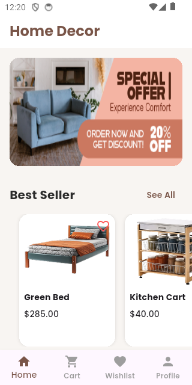 | 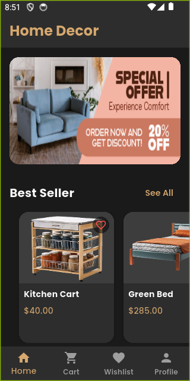 |
| 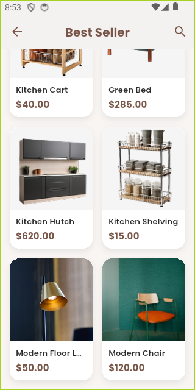 |  |
| 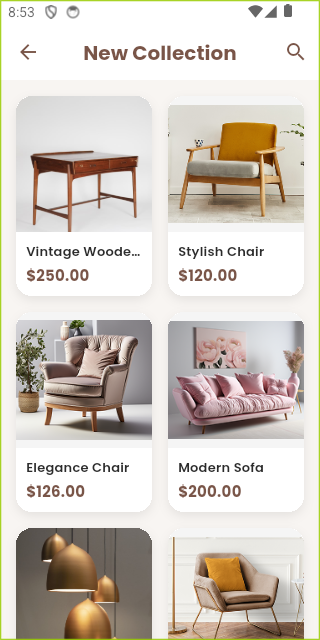 | 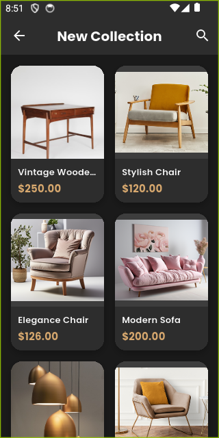 |

### 🛒 Shopping

| Light Mode | Dark Mode |
|------------|-----------|
|  | 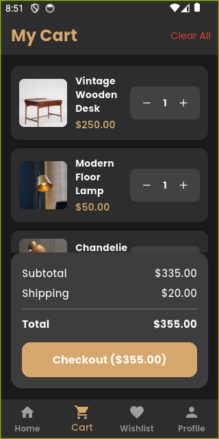 |
| 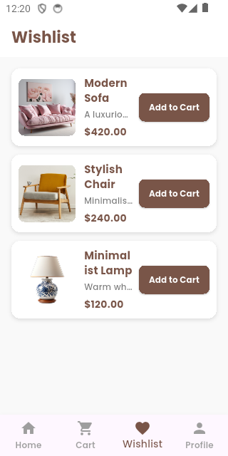 | 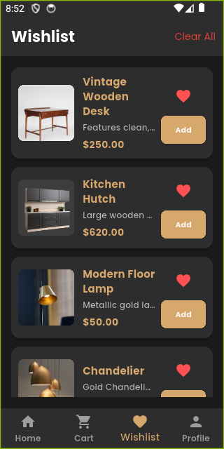 |
| 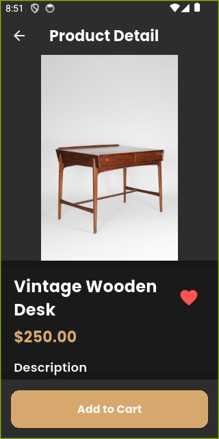 | |

### 💳 Checkout Flow

| Light Mode | Dark Mode |
|------------|-----------|
| 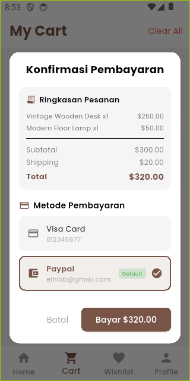 | 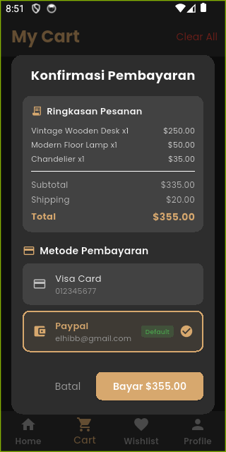 |
| 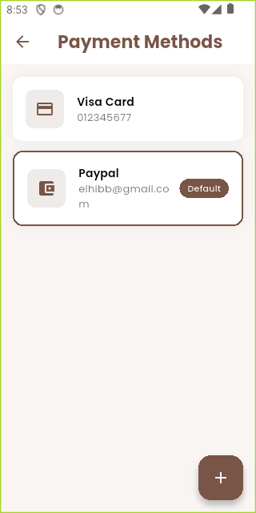 | 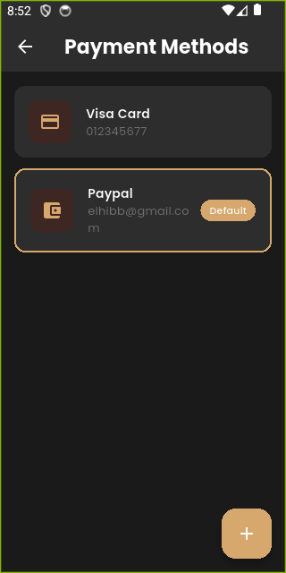 |
| 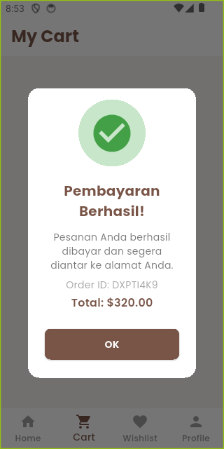 | 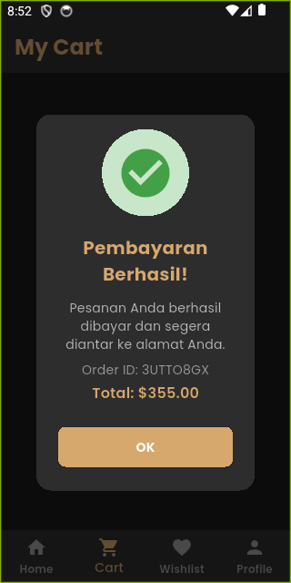 |

### 👤 Profile & Settings

| Light Mode | Dark Mode |
|------------|-----------|
| 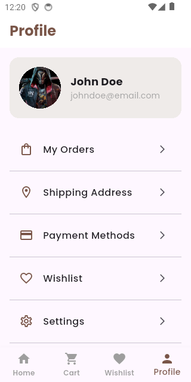 | 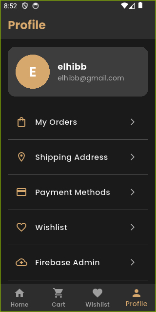 |
| 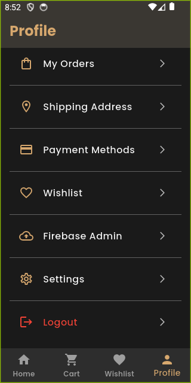 | |
| 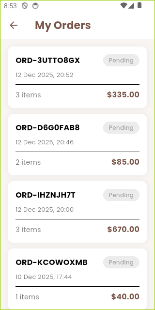 | 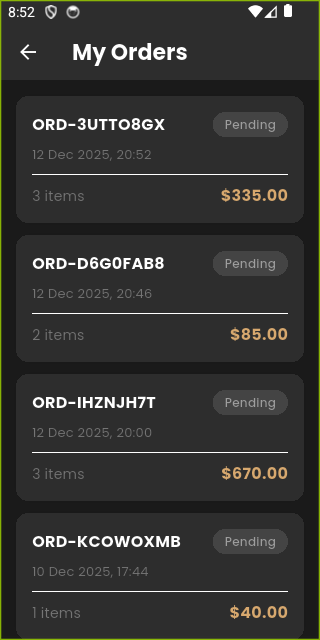 |
| 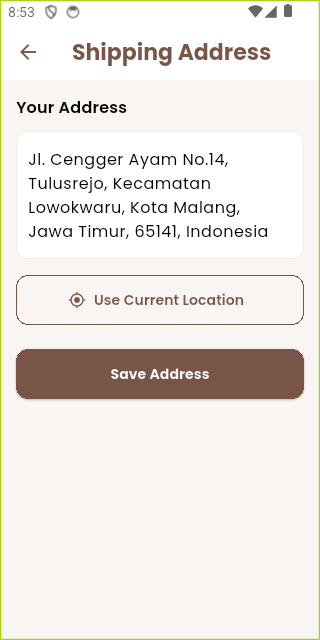 | 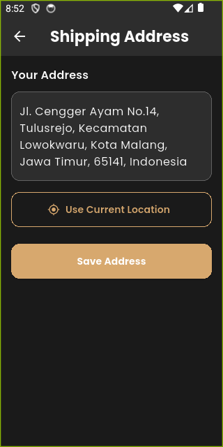 |
| 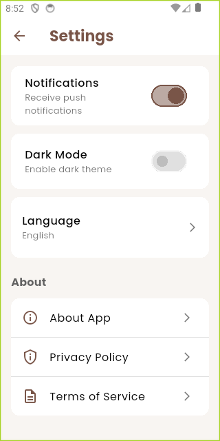 | 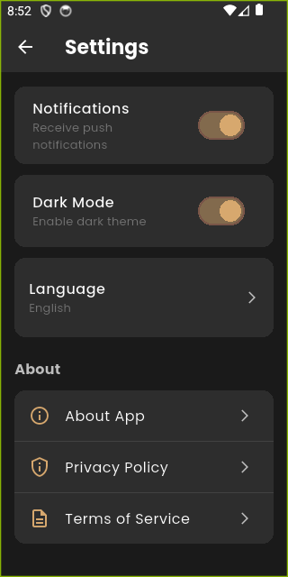 |

### 🔥 Firebase Admin

| Screenshot |
|------------|
| 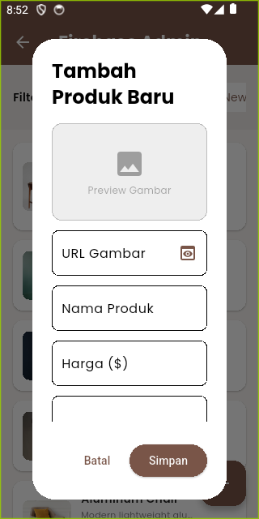 |
| 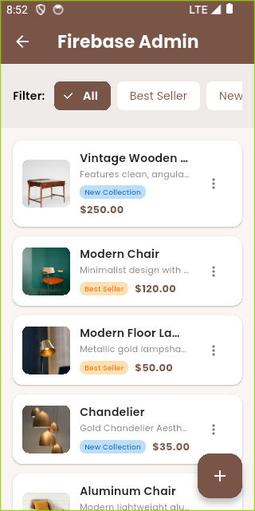 |

---

## ✨ Fitur Highlights

- 🔥 **Real-time Sync** - Data otomatis update dengan Firebase
- 🌙 **Dark Mode** - Toggle tema gelap/terang
- 🌐 **Multi-language** - ID & EN support
- 🛒 **Smart Cart** - Sinkronisasi antar device
- 💳 **Payment Dialog** - Konfirmasi sebelum checkout
- 📱 **Responsive** - Optimal di berbagai ukuran layar
